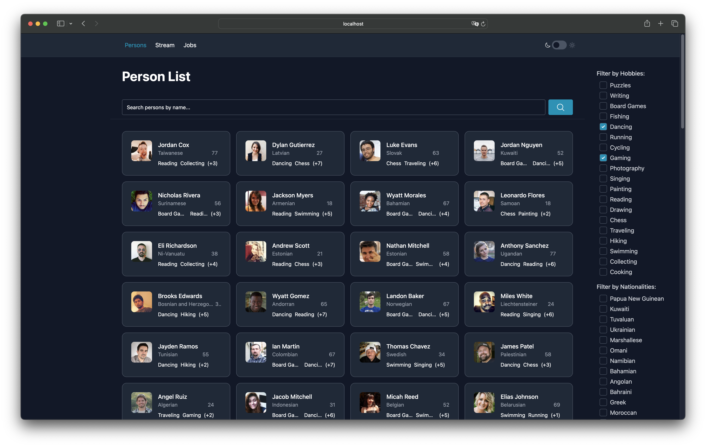
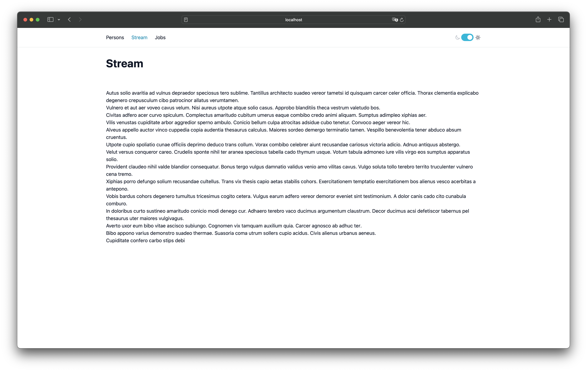
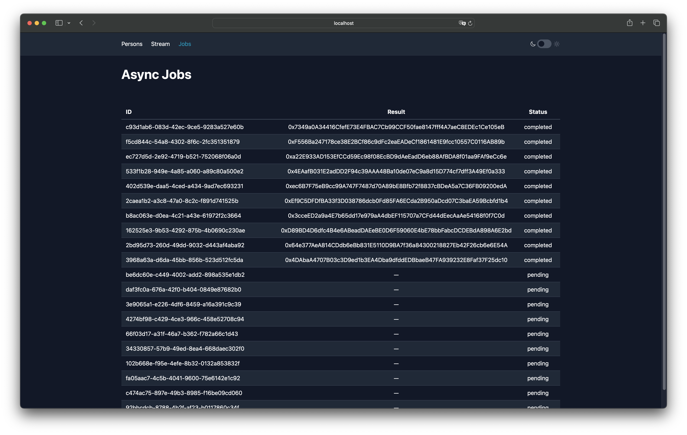

  

## Run with Docker Compose

### Requirements
- Docker and Docker Compose
- Node.js >= 22

### Commands
```sh
git clone https://github.com/iiojib/presight-execise.git
cd presight-execise
cp .env.example .env # Adjust as needed
npm install
npm --ws run build
docker compose up --build
```
By default, the application will be available at [http://localhost:8080](http://localhost:8080).
You can change the port in the `.env` file.

---

## Run in VS Code Dev Container

### Requirements
- VS Code with Dev Containers extension
- Docker and Docker Compose

### Commands
```sh
git clone https://github.com/iiojib/presight-execise.git
code presight-execise # Or open in VS Code manually
```
- `Ctrl+Shift+P` / `Cmd+Shift+P` -> `Dev Containers: Reopen in Container`
- `Ctrl+Shift+P` / `Cmd+Shift+P` -> `Tasks: Run Task` -> `Migrate Database`
- `Ctrl+Shift+P` / `Cmd+Shift+P` -> `Tasks: Run Task` -> `Start API`
- `Ctrl+Shift+P` / `Cmd+Shift+P` -> `Tasks: Run Task` -> `Start Client`

Browser: [http://localhost:8080](http://localhost:8080)

---

## Run Manually

### Requirements
- Node.js 22+
- PostgreSQL
- [migrate CLI](https://github.com/golang-migrate/migrate/tree/master/cmd/migrate)

### Commands
```sh
git clone https://github.com/iiojib/presight-execise.git
cd presight-execise
cp .env.example .env # Adjust as needed
npm install
npm run env:migrate:up
```
In separate terminals:
```sh
npm -w server run dev
```
```sh
npm -w client run dev
```
